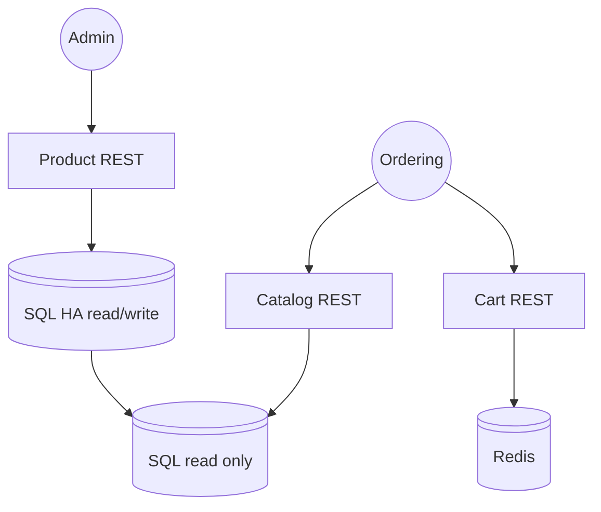

# ECommerce back-end

The premise of this work is to build an e-commerce back-end using C#, SQL and Entity Framework. It was initially a coding exercise.

# Target architecture

Given the requirement to use SQL server, this should be a reasonably scalable approach:



# Implementation notes

## APIs that allow search, filter, and show results for products in product catalog  

There are three services provided: product, catalog and cart. Product and catalog are operating on the same data, but have different loads and use cases (catalog is search heavy and read only). For this iteration, product and catalog are built out of the same codebase. The product and catalog features can be turned on or off by using feature flags in the configuration, enabling different deployments from the same code.

The search functionality lives in catalog, using Dynamic Linq.

## Admin APIs for managing products

In the product folder

## APIs to support shopping cart functionality with session-based storage

In the catalog folder

## Use a layered architecture (e.g., Controller, Service, Repository).

Please see the subfolders in the respective projects.

## Implement caching for frequently accessed data (e.g., product catalog) using in-memory caching.

In the catalog API

## Use SQL database, Entity Framework Core to interact with databases

Using EF core and the SQL provider into LocalDB for development

## Create a middleware component that logs the request and response details (e.g., headers, status codes, execution time).

This is accomplished by using the Serilog.AspNetCore library. The RequestHeaderLoggingMiddleware class is used to log headers.

### Examples

```
[11:57:57 INF] Request GET /api/categories headers: {"Accept": ["*/*"], "Connection": ["close"], "Host": ["localhost:5086"], "User-Agent": ["Thunder Client (https://www.thunderclient.com)"], "Accept-Encoding": ["gzip, deflate, br"], "Content-Type": ["application/json"], "Content-Length": ["21"]}

[11:57:58 INF] Request finished HTTP/1.1 GET http://localhost:5086/api/categories - 200 null application/json; charset=utf-8 591.7661ms
```


## Use dependency injection to inject a custom service (e.g., ILoggingService) into the middleware. Demonstrate the use of scoped, transient, and singleton lifetimes for services in the application.

Using dependency injection to inject the ISystem abstraction. Note DbContext lifetime is scoped, this is not directly evident from the code since Entity Framework has it's own configuration builder.

## Add unit tests, mock data, for the middleware and service

Unit tests projects are present

## Implement pagination for endpoints as applicable

Implemented pagination for the GetAll and Query endpoints

## Include proper error handling, logging, and input validation

Absent a more detailed specification, some reasonable validation is implemented. Category names are enforced to be unique, product names are not. Logging is accomplished with Serilog. If a product name exceeds the database limit for the column, status 500 will be returned. Better/friendlier validation is needed.

# Bonus

## Add JWT-based authentication and authorization

Token authentication is implemented using AWS Cognito as the identity provider. It uses a simple security model with read and write access group (uw-ecom-api/read and uw-ecom-api/write). Access checks for write are implemented, the other endpoints currently just require a valid token.

To obtain a token, use the client credentials (machine to machine) flow. I will provide the client ID and client secret upon request.

Edit: It turns out that AWS Cognito does not support VPC. In other words, the service can't reach the discovery endpoint on the IAM to download the certificates it needs to validate tokens. I opted not to pay for an implement the outbound NAT required to reach the discovery endpoint over the public internet, and disabled authentication for most endpoints.

##  Integrate a third-party payment gateway (mock implementation is fine)

Not provided

## Containerize the service via Docker

Dockerfile provided for product/catalog. It is built automatically on github via github action. To build locally, use the publish.ps1 scripts provided

##  Deploy the service to AWS cloud

Deployed to AWS by using
* Cognito
* App Runner
* Elastic Container Registry
* RDS

URL available upon request

## Include time complexity and space complexity for each of the APIs as comments in the code

This is a difficult question to answer since we are making heavy use of a database. As far as the API is concerned, operations concerning a single record are simply O(1) and operations concerning multiple records are simply O(N).
Assuming database index is present and uses a tree, record retrieval would be considered O(log n). With no index present, it will scan the entire column O(n). More complex searches and ordering can cause multiple table scans or temporany tables to be created.

# Development

## Prerequisites

Docker is recommended (required to build the container). You will also need the EF tooling:

`dotnet tool install --global dotnet-ef`